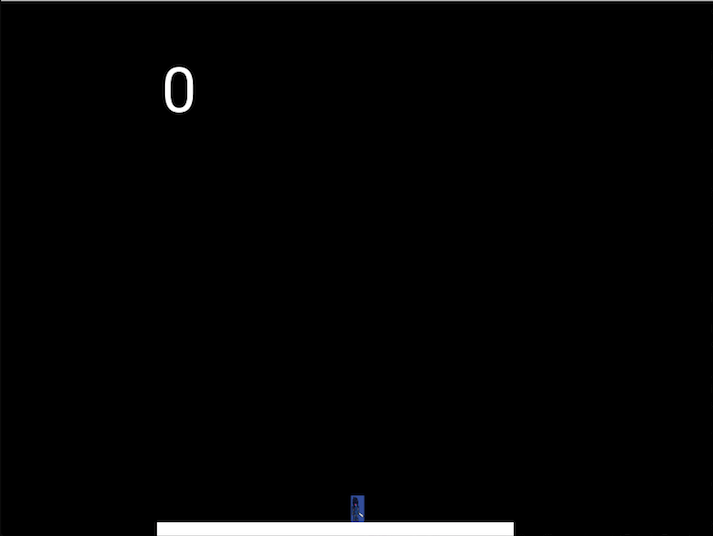

# ScrollGame
Scroll type game that features a character that jumps to blocks to continue traveling.

### Keybinding

* Jump - W
* Pause - P
* Start (when paused) - S

### Features

* Restarts orientation when character falls off block (map)
* Score is shown (distance traveled)

### Future Plans

* Create more blocks that character can jump to while scrolling
* Create a menu that one can start game from instead of automatically starting
* Add stars that character can grab
* Change how score is shown

### Game Running

